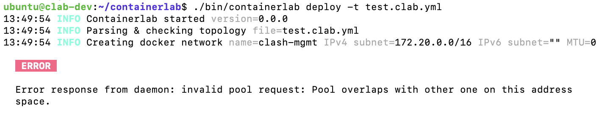
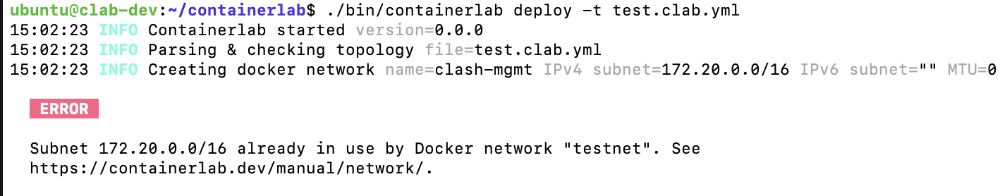

# Open Source Contribution Report  

**Project:** [srl-labs/containerlab](https://github.com/srl-labs/containerlab)  
**Contribution:** Improve subnet overlap error message for Docker mgmt network (Fixes [#2786](https://github.com/srl-labs/containerlab/issues/2786))  
**Pull Request:** https://github.com/srl-labs/containerlab/pull/2845  
**Contributor:** Meghana Gorripati  

---

## Context
- **Problem:** When a user deploys a containerlab topology with a subnet that overlaps an existing Docker network, containerlab returned Docker’s raw error:

  ```text
  Error response from daemon: invalid pool request: Pool overlaps with other one on this address space.
  ```

  This was confusing and did not tell users which Docker network was causing the issue.  

- **Goal:** Update containerlab to **catch subnet overlap errors** and show a **clear, actionable error message** that identifies the conflicting Docker network.  

---

## Environment Setup

### 1. Fork & Clone
```bash
git clone https://github.com/mgorripa/containerlab.git
cd containerlab
```

---

### 2. Initial Build on macOS (failed)
- Attempted build:
  ```bash
  make build
  ```
- Errors seen:
  - `undefined: unix.NFPROTO_IPV4`
  - `pkg/ns: build constraints exclude all Go files`
- **Reason:** containerlab’s build dependencies require Linux.  
- **Fix:** Switched to an **Ubuntu VM**.

---

### 3. Install Go (correct version)
- Initially had Go 1.24, but containerlab required Go 1.23.  
- Installed Go 1.23.2:

```bash
wget https://go.dev/dl/go1.23.2.linux-amd64.tar.gz
sudo rm -rf /usr/local/go
sudo tar -C /usr/local -xzf go1.23.2.linux-amd64.tar.gz
echo 'export PATH=$PATH:/usr/local/go/bin' >> ~/.bashrc
source ~/.bashrc
go version   # go1.23.2
```

---

### 4. Successful Build
```bash
make build
./bin/containerlab version
```

---

## Reproducing the Bug

### 5. Create a Conflicting Docker Network
```bash
docker network create --subnet=172.20.0.0/16 testnet
```

### 6. Deploy a Test Topology
```bash
./bin/containerlab deploy -t test.clab.yml
```

**Observed Error (before fix):**
```text
Error response from daemon: invalid pool request: Pool overlaps with other one on this address space.
```

---

## Implementing the Fix

### 7. Locate Code
Searched for Docker network creation call:
```bash
grep -R --line-number "NetworkCreate(" .
```
Found in `runtime/docker/docker.go`, inside function:
```go
func (d *DockerRuntime) createMgmtBridge(...) (string, error)
```

---

### 8. Add Custom Error Handling
Modified error block:

```go
netCreateResponse, err := d.Client.NetworkCreate(nctx, d.mgmt.Network, opts)
if err != nil {
    if strings.Contains(err.Error(), "Pool overlaps") || strings.Contains(err.Error(), "subnet") {
        nets, _ := d.Client.NetworkList(nctx, networkapi.ListOptions{})
        for _, n := range nets {
            for _, cfg := range n.IPAM.Config {
                if cfg.Subnet == d.mgmt.IPv4Subnet {
                    return "", fmt.Errorf(
                        "Subnet %s already in use by Docker network %q. See https://containerlab.dev/manual/network/",
                        cfg.Subnet, n.Name,
                    )
                }
            }
        }
        return "", fmt.Errorf(
            "Requested subnet %s overlaps an existing Docker network. Original error: %v. See https://containerlab.dev/manual/network/",
            d.mgmt.IPv4Subnet, err,
        )
    }
    return "", err
}
```

Important: The function signature was `(string, error)`, so error returns needed `""` for the first value.  

---

## Verifying the Fix

### 9. Rebuild
```bash
make build
```

### 10. Test Again
```bash
./bin/containerlab deploy -t test.clab.yml
```

**New Error Message (after fix):**
```text
Subnet 172.20.0.0/16 already in use by Docker network "testnet".
See https://containerlab.dev/manual/network/
```

Clear and actionable.

**Before (main)**


**After (this PR)**


---

## Submitting the Contribution

### 11. Git Identity
```bash
git config --global user.name "mgorripa"
git config --global user.email "mgorripa@purdue.edu"
```

### 12. Commit
```bash
git checkout -b fix/subnet-overlap-error
git add runtime/docker/docker.go
git commit -m "Improve subnet overlap error message for Docker mgmt network

Previously, when a requested subnet overlapped with an existing Docker
network, containerlab returned Docker's raw error.

Now, containerlab detects the overlap and returns a clearer error:

    Subnet 172.20.0.0/16 already in use by Docker network \"testnet\".
    See https://containerlab.dev/manual/network/

This helps users quickly identify the conflicting network."
```

### 13. Push via SSH
```bash
git remote set-url origin git@github.com:mgorripa/containerlab.git
git push origin fix/subnet-overlap-error
```

### 14. Open Pull Request
- Opened PR against `srl-labs/containerlab:main`.  
- Linked to issue #2786.  
- Included before/after comparison and screenshots.  

---

## Outcome
- Open-source contribution submitted.  
- Improved containerlab’s usability with **better error messages**.  
- Understood and practiced:
  - Environment setup & troubleshooting  
  - Reproducing real bugs  
  - Implementing fixes in Go  
  - Git workflow (branch, commit, PR)  
  - Open-source contribution etiquette  

---

## Key Takeaways
- **Problem-solving:** Translated confusing raw Docker errors into actionable feedback.  
- **Debugging:** Handled Go environment issues across macOS and Linux.  
- **Code Quality:** Matched function signatures, added safe error fallbacks.  
- **Documentation:** Captured every step for reproducibility.  
- **Collaboration:** Followed open-source contribution best practices.  

---

This is a technical documentation. It demonstrates **end-to-end contribution skills**: from setup to bug reproduction, code fix, testing, and PR submission.  

---

## Appendix: `test.clab.yml` (used to reproduce the subnet overlap)

```yaml
name: testlab

mgmt:
  network: clash-mgmt
  ipv4-subnet: 172.20.0.0/16

topology:
  nodes:
    n1:
      kind: linux
      image: alpine
```
