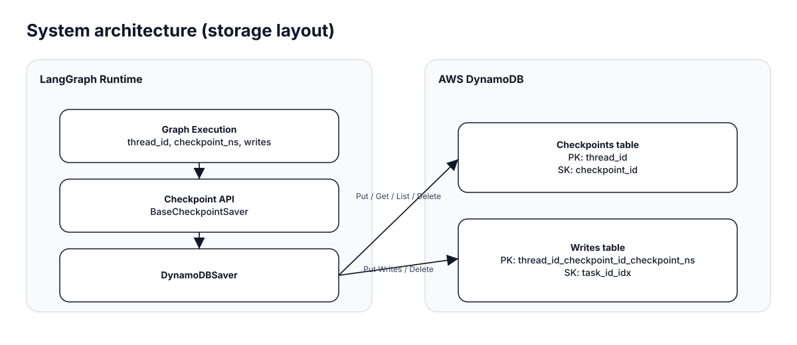
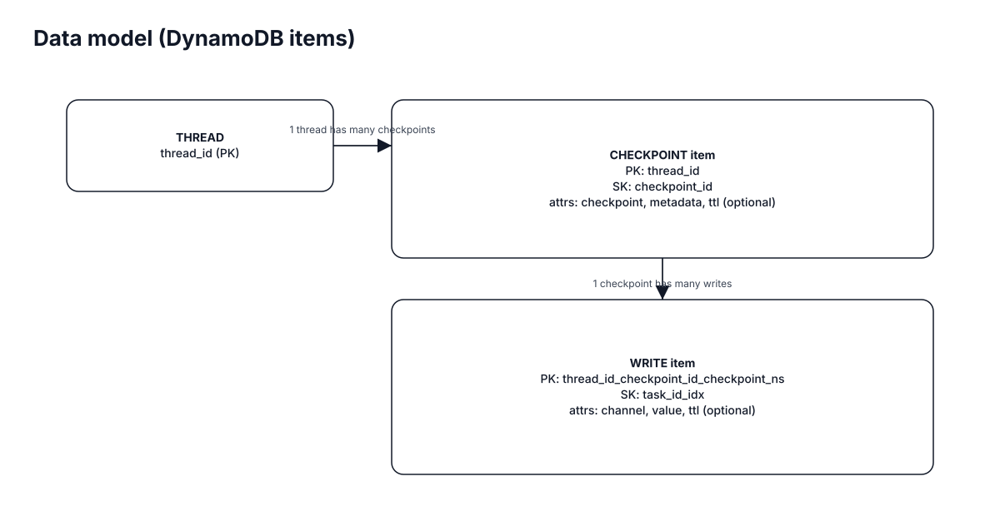
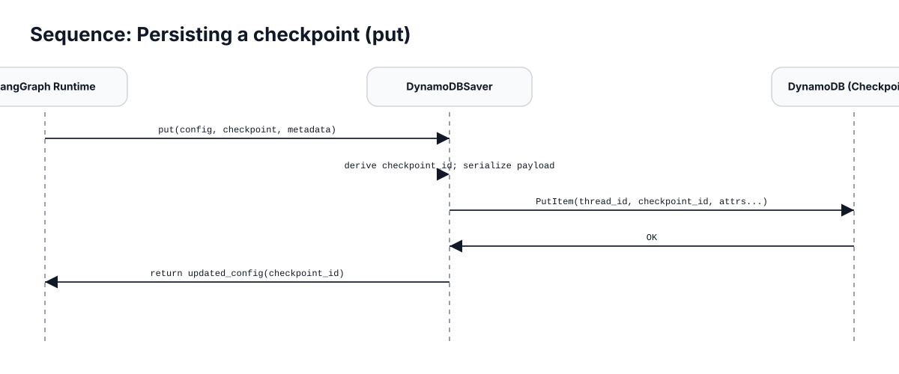
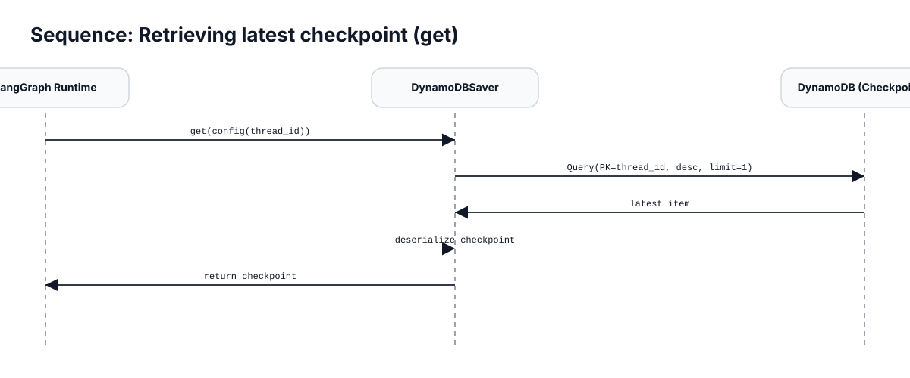
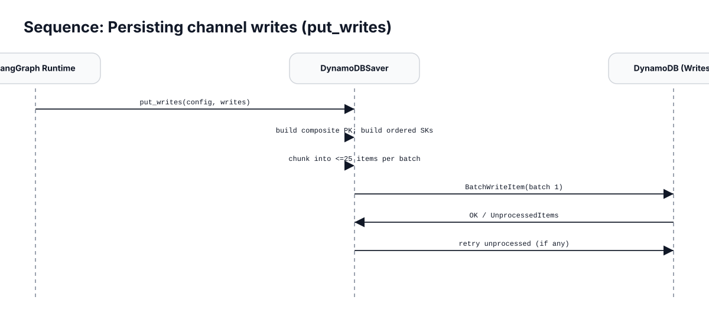
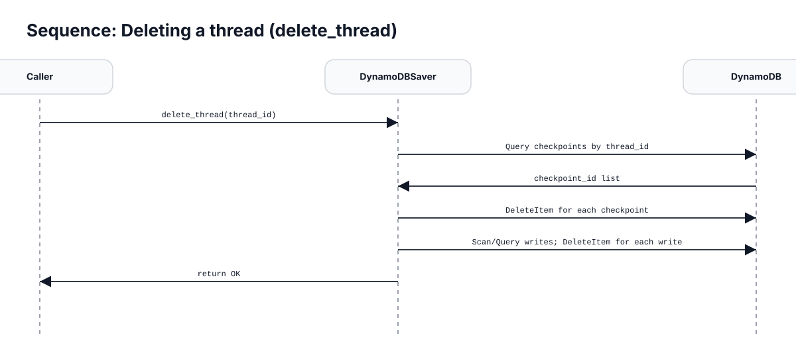

# DynamoDB Checkpointer for LangGraph  
Open Source Feature Contribution  

**Pull Request:** https://github.com/langchain-ai/langgraph/pull/6144  
**Repository:** https://github.com/langchain-ai/langgraph  
**Contribution Type:** New Feature Implementation  

---

# 1. Overview

This contribution introduces a **DynamoDB-backed checkpointing implementation** for LangGraph by extending the framework’s `BaseCheckpointSaver` interface.

LangGraph enables stateful AI agent workflows that require durable execution state. At the time of this contribution, the framework did not include a DynamoDB-based persistence backend.

This pull request implemented a complete backend:

```
DynamoDBSaver
```

The feature was fully implemented, tested, and documented. The PR was later closed due to maintainer scope decisions regarding official checkpointer expansion.

---

# 2. Why This Feature Was Needed

LangGraph agents depend on checkpointing to:

- Resume interrupted workflows  
- Persist execution state across steps  
- Store intermediate channel writes  
- Support distributed execution models  
- Enable long-running processes  

While the `BaseCheckpointSaver` abstraction existed, a DynamoDB implementation was missing.

DynamoDB was selected because it provides:

- Managed infrastructure  
- Horizontal scalability  
- High availability  
- Built-in TTL support  
- Seamless AWS ecosystem integration  

This makes it well-suited for enterprise-grade, cloud-native agent systems.

---

# 3. Architecture Diagrams

## 3.1 System architecture (storage layout)



The runtime flow:

1. LangGraph execution calls `BaseCheckpointSaver`
2. `DynamoDBSaver` implements the interface
3. Two DynamoDB tables store:
   - Checkpoints
   - Channel writes

---

## 3.2 Data model (DynamoDB tables)



### Checkpoints Table

- **Partition Key:** `thread_id`
- **Sort Key:** `checkpoint_id`
- Attributes:
  - `checkpoint`
  - `metadata`
  - `ttl` (optional)

### Writes Table

- **Partition Key:** `thread_id_checkpoint_id_checkpoint_ns`
- **Sort Key:** `task_id_idx`
- Attributes:
  - `channel`
  - `value`
  - `ttl` (optional)

This separation prevents checkpoint inflation and supports scalable write throughput.

---

# 4. How the Implementation Works

## 4.1 Persisting a Checkpoint (`put`)



Flow:

1. Extract `thread_id` from config  
2. Derive or accept `checkpoint_id`  
3. Serialize checkpoint + metadata  
4. Write item into Checkpoints table  
5. Return updated config  

---

## 4.2 Retrieving Latest Checkpoint (`get`)



Flow:

1. Query checkpoints table by `thread_id`
2. Retrieve latest checkpoint (descending order, limit 1)
3. Deserialize payload
4. Return structured checkpoint

---

## 4.3 Persisting Channel Writes (`put_writes`)



Key implementation detail:

- DynamoDB limits batch writes to **25 items**
- Writes are chunked automatically
- Retries are performed for unprocessed items

This shields users from underlying DynamoDB constraints.

---

## 4.4 Deleting a Thread (`delete_thread`)



Flow:

1. Query all checkpoints for `thread_id`
2. Delete each checkpoint
3. Scan / query writes table for related entries
4. Delete associated writes

Future optimization could include a GSI to eliminate scan operations.

---

# 5. Design Decisions and Trade-offs

## Separate Tables for Checkpoints and Writes

Benefits:

- Prevents checkpoint item growth
- Enables independent scaling
- Improves read performance
- Simplifies retention policies

---

## TTL Support

Optional TTL enables:

- Automatic cleanup
- Reduced storage costs
- Ephemeral workflow support

Important note: DynamoDB TTL is eventual, not immediate.

---

## Batch Write Handling

- Automatic chunking (≤ 25 items)
- Retry handling for unprocessed items
- Transparent to caller

---

## Consistency Model

By default, DynamoDB provides eventual consistency.  
Strongly consistent reads could be configured if required for multi-worker workflows.

---

# 6. Usage Example

```python
from langgraph.checkpoint.dynamodb import DynamoDBSaver

saver = DynamoDBSaver(
    table_name="checkpoints",
    writes_table_name="writes",
    region_name="us-east-1",
    ttl_seconds=3600
)

config = {"configurable": {"thread_id": "thread-1"}}

checkpoint = {"state": {"step": 1}}
metadata = {"source": "example"}

updated_config = saver.put(config, checkpoint, metadata)

latest = saver.get(config)

writes = [
    ("channel_1", {"value": 123}),
    ("channel_2", {"value": "abc"})
]

saver.put_writes(config, writes)

saver.delete_thread("thread-1")
```

---

# 7. Testing Strategy

Testing was implemented using:

- `pytest`
- `moto` (DynamoDB mocking library)

Advantages:

- No AWS credentials required
- Fully isolated tests
- Deterministic behavior
- CI compatible

Test coverage includes:

- Checkpoint creation
- Retrieval
- Listing
- Write storage
- Thread deletion

---

# 8. Engineering Depth Demonstrated

This contribution demonstrates:

- Extending a framework via interface-driven design
- NoSQL schema modeling
- DynamoDB partition/sort key strategy
- Distributed system persistence logic
- Handling AWS operational constraints
- Writing isolated service-mocked unit tests
- Documenting architecture clearly

---

# 9. Contribution Outcome

The PR was reviewed and closed due to repository scope decisions regarding official checkpointer expansion.

However:

- The implementation was complete
- The feature worked correctly
- Tests passed
- Documentation was included
- Architecture was clean and extensible

---

# 10. Key Technical Skills Demonstrated

- Python backend development
- AWS DynamoDB integration
- Distributed systems thinking
- API interface design
- Schema modeling
- Batch processing constraints
- Async compatibility
- Open-source collaboration

---

# 11. References

- Pull Request: https://github.com/langchain-ai/langgraph/pull/6144  
- LangGraph Repository: https://github.com/langchain-ai/langgraph  
